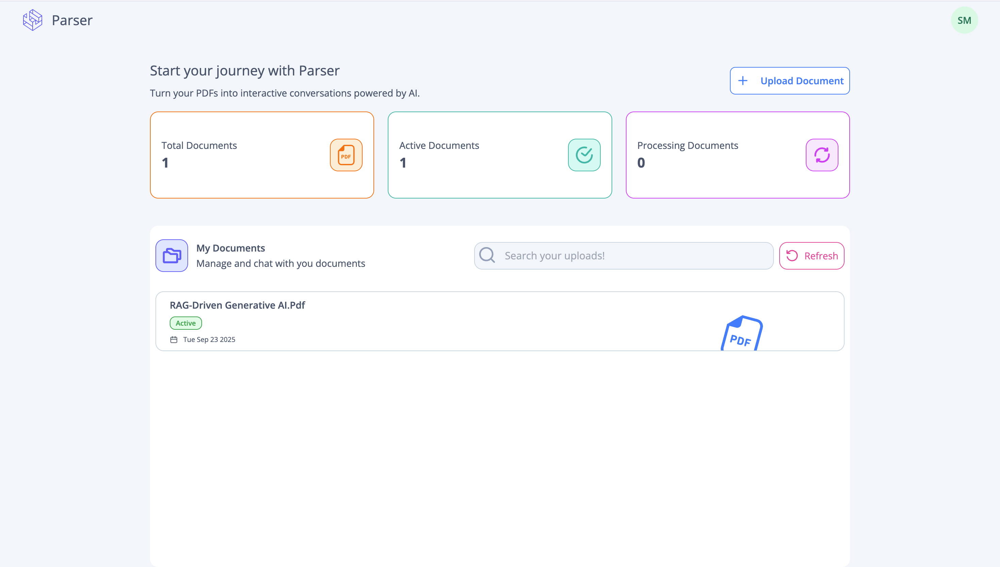
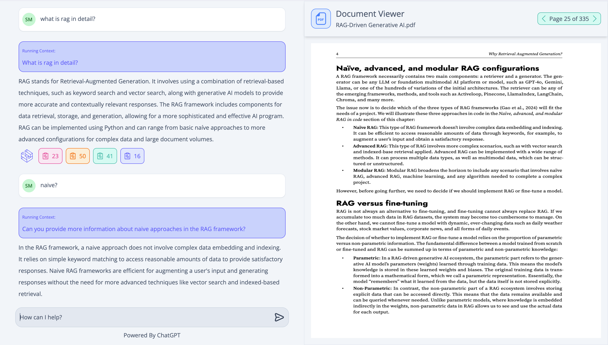

# Parser

<div align='center'>
    
</div>

This is a PERN (Postgres, Express, React, Nodejs) application to pdf files and have conversation with ChatGPT. This is a side project intended for me to learn langchain and RAG, for chunking and retrieving pdf data and using that to converse with a LLM model. Along with langchain, I also learnt about authentication via jwt and worker instances for background processes. (I still need to work on the UI side to make the website look more appealing).

#### Inspiration:

I got my inspiration to work on this project after I finished a course "ChatGPT and LangChain: The Complete Developer's Masterclass"
from udemy.

#### Setup:

1. Clone the repository

   ```sh
   git clone https://github.com/sameera-g-mathad/parser.git
   ```

2. Create a `.env` file in the root directory and add the following environment variables. This file is used by both api and worker instances.

   ```env
   AWS_ACCESS_KEY=<AWS Access Key>
   AWS_SECRET_KEY=<AWS Secret Key>
   AWS_REGION=<AWS Region>
   AWS_BUCKET=<AWS Bucket Name>
   Open_Api_Key=<OpenAI API Key>

   // configuration used in docker-compose file
   PGDATABASE=postgres
   PGHOST=postgres
   PGPASSWORD=postgres
   PGPORT=5432
   PGUSER=postgres
   PORT=4000
   REDISURL=redis://redis:6379

   // configuration of weburl:
   WEB_URL = 'http://localhost:3050' // your-url
   ```

3. Create a `.env` file in the `api` folder and add the following environment variables. This is to handle authentication and authorization.

   ```env
   JWT_SECRET_KEY=<Secret Key for signing JWT>

   # Default experation time for jwt token is 1 day
   JWT_EXPIRES=1d
   JWT_COOKIE_EXPIRES=1
   ```

4. Create a `.env` file in the `worker` folder and add the following environment variables. This is to handle sending emails and could be platform dependent. The platform I used for this project is [brevo](https://app.brevo.com/) to send emails.

   ```env
   SMTP=<Your SMTP host>
   PORT=<Your SMTP port>
   USER=<Your SMTP user>
   PASSWORD=<Your SMTP password>
   FROM=<Email from which the email is sent>
   ```

5. Make sure you have `docker` and `docker-compose` installed in your machine. Also, I use Makefile to handle commands and this requires `make` to be installed in your machine.

- To build and run the project, use the following command:

  ```sh
  make build
  ```

- To run the project without building, use the following command:

  ```sh
  make up
  ```

- To stop the project, use the following command:

  ```sh
  make down
  ```

- To prune unused docker images, use the following command:

  ```sh
  make prune
  ```

- To remove all the containers, volumes and images created by the project, use the following command:

  ```sh
  make clean
  ```

- **Note:** Api may throw error first time as nodemon is used to run the server, you can stop the container and run `make up` again.
- **Note:** If you get an error in `.worker/Dockerfile.dev` at the line
  `RUN rm -r build` while building, it is because the build folder is not created yet. You can ignore the error and run `make up` again.

#### Architecture:


- `Nginx` - Docker image along with configuration file used for path routing. Files can be found in the nginx folder.
- `React` - (typescript + vite) for frontend. Consists of auth and app flow once authenticated.
- `Api` - Used to handle user request. Implemented using Express with typescript. Responsible for authentication and authorization as well as retrieving data and stream responses from ChatGPT. Has access to postgres, redis and s3 bucket. Also, uses redis to publish events that is picked up by the worker instance.
- `Worker` - Has access to postgres, redis and s3 bucket instances. Mainly used for handling emails, and also heavy tasks (one in this case) such as receiving file, parsing using langchain, chunking it, and storing both pdf in s3 bucket and embeddings in postgres database.
- `Postgres` - Using a relational database for storing information in '**users**', '**uploads**', and '**conversation**' and '**documents**' tables. Using `pgvector` docker image as it is easy to store both vector information and user information.
- `Redis` - A memory database to store using information, conversations, uploads and also publish and subscribe events. The infomation stored in redis is setup with expiration date as well.
- `S3 bucket` - To persist pdf files uploaded by the user.

#### Working:

1. User signs up to the website, a verification link is sent to the email provided by the user. Once the user clicks on the link, their email is verified and they can sign in to the website. Worker instance handles sending the email to the user.
2. Once signed in, user can upload a pdf file. The file is sent to the api instance which stores the file temporarily in a `shared volume` between **api** and **worker** and publishes an event to the worker instance.
3. `The worker instance picks up the event, reads the file from the shared volume. The pdf is uploaded to the s3 bucket, parses it using langchain, chunks it and stores the embeddings in the postgres database and finally the temporary file in the shared volume is deleted. An email is sent to the user once the upload is successful or failed.`
4. Once the upload is successful, user can see the file in the homepage. User can click on the file to go to the chat page.
5. In the chat page, user can see the pdf on the right side of the screen, and a chat interface on the left side of the screen.
6. User can ask questions related to the pdf file, the question is sent to the api instance. The api instance uses langchain to fetch relevant documents from the database and uses that to prompt ChatGPT and streams the response back to the user. The conversation is also stored in the database.
7. `The Conversation streaming is a two step process. This is because user questions can sometimes be vague and out of context. So first the question is sent to ChatGPT with a prompt to make the question more clear and precise taking in the entire conversation if present. The condensed standalone question is then used to fetch relevant documents from the database and then sent to ChatGPT along with the documents to get a more accurate response.`

##### Technologies Used:

Apart from the Pern stack and the architeture, other technologies used in the project.

- `Docker` - For container orchestration.
- `Langchain`- For parsing files, splitting, chunking and storing embeddings in the database. Also used to create a rag pipeline to fetch documents from the database and stream responses from the llm.
- `ChatGPT` - Used as a primary llm for streaming task.
- `react-router-dom` - For routing pages in react, handles both auth and app flow.
- `pdfjs-dist` - For displaying pdfs in the frontend. Handles loading of pdf and also for navigating the pdf.
- `Tailwind` - For styling components in the frontend with css.
- `jsonwebtoken` - For signing and verifying jwt tokens.
- `Nodemailer`- Used to send emails from the worker instance.

#### Features:

- SignUp - Users can sign up to the website. A url will be sent to their email before validating the entered email.
<div align="center">
 
</div>
- Verification Link - A link is sent to the user via email to verify themselves.

<div align="center">
 
</div>
- SignIn - Allows user to signin to the website.
<div align="center">
 
</div>

- Forgot/Reset Password:
<table>
 <tbody>
     <tr>
         <td></td>
         <td></td>
     </tr>
 </tbody>
</table>

- Home page:
<div align="center">
 
</div>

- Chat page:
<div align="center">
 
</div>

- Emails:
<table>
 <tbody>
     <tr>
         <td></td>
         <td></td>
          <td></td>
         <td></td>
     </tr>
 </tbody>
</table>

#### References:

- Udemy Course: [ChatGPT and LangChain: The Complete Developer's Masterclass](https://www.udemy.com/course/chatgpt-and-langchain-the-complete-developers-masterclass)
- Logo desgin: https://www.vistaprint.com/hub/logo-design
- complete-node-bootcamp: https://github.com/jonasschmedtmann/complete-node-bootcamp
- multi-docker: https://github.com/StephenGrider/multi-docker
- Installing tailwind on vite: https://tailwindcss.com/docs/installation/using-vite
- ChatGPT API: https://platform.openai.com
- Brevo (formerly known as sendinblue): https://www.brevo.com/
- Using pdfjs in react: https://www.npmjs.com/package/pdfjs-dist
- Svg icons: https://www.svgrepo.com/
- LLMs like claude and gpt for bug fixes.
