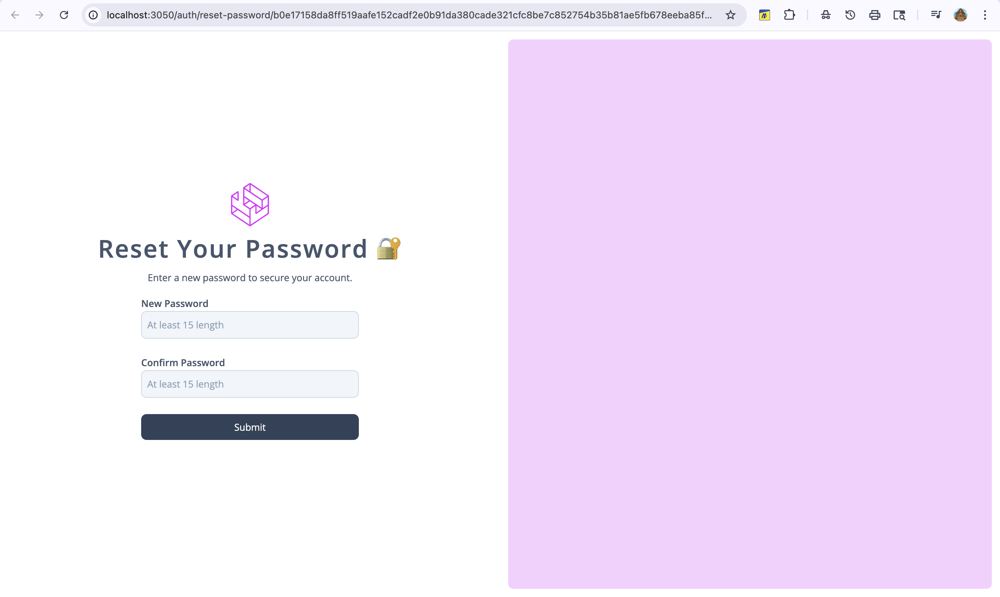

# Parser

    

This is a PERN (Postgres, Express, React, Nodejs) application to pdf files and have conversation with ChatGPT. This is a side project intended for me to learn langchain and RAG, for chunking and retrieving pdf data and using that to converse with a LLM model. Along with langchain, I also learnt about authentication via jwt and worker instances for background processes. (I still need to work on the UI side to make the website look more appealing).

##### Inspiration

I got my inspiration to work on this project after I finished a course "ChatGPT and LangChain: The Complete Developer's Masterclass"
from udemy.

##### Architecture:

- `Nginx` - Docker image along with configuration file used for path routing. Files can be found in the nginx folder.
- `React` - (typescript + vite) for frontend. Consists of auth and app flow once authenticated.
- `Api` - Used to handle user request. Implemented using Express with typescript. Responsible for authentication and authorization as well as retrieving data and stream responses from ChatGPT. Has access to postgres, redis and s3 bucket. Also, uses redis to publish events that is picked up by the worker instance.
- `Worker` - Has access to postgres, redis and s3 bucket instances. Mainly used for handling emails, and also heavy tasks (one in this case) such as receiving file, parsing using langchain, chunking it, and storing both pdf in s3 bucket and embeddings in postgres database.
- `Postgres` - Using a relational database for storing information in '**users**', '**uploads**', and '**conversation**' and '**documents**' tables. Using `pgvector` docker image as it is easy to store both vector information and user information.
- `Redis` - A memory database to store using information, conversations, uploads and also publish and subscribe events. The infomation stored in redis is setup with expiration date as well.
- `S3 bucket` - To persist pdf files uploaded by the user.

#### Technologies Used.

Apart from the Pern stack and the architeture, other technologies used in the project.

- `Docker` - For container orchestration.
- `Langchain`- For parsing files, splitting, chunking and storing embeddings in the database. Also used to create a rag pipeline to fetch documents from the database and stream responses from the llm.
- `ChatGPT` - Used as a primary llm for streaming task.
- `react-router-dom` - For routing pages in react, handles both auth and app flow.
- `pdfjs-dist` - For displaying pdfs in the frontend. Handles loading of pdf and also for navigating the pdf.
- `Tailwind` - For styling components in the frontend with css.
- `jsonwebtoken` - For signing and verifying jwt tokens.
- `Nodemailer`- Used to send emails from the worker instance.

##### Features

- SignUp - Users can sign up to the website. A url will be sent to their email before validating the entered email.

    

- Verification Link - A link is sent to the user via email to verify themselves.

    

- SignIn - Allows user to signin to the website.

    

- Forgot/Reset Password:
<table>
    <tbody>
        <tr>
            <td></td>
            <td></td>
        </tr>
    </tbody>
</table>

- Home page:

    

- Chat page:

    

- Emails:
<table>
    <tbody>
        <tr>
            <td></td>
            <td></td>
             <td></td>
            <td></td>
        </tr>
    </tbody>
</table>

Installing tailwind on vite: https://tailwindcss.com/docs/installation/using-vite
